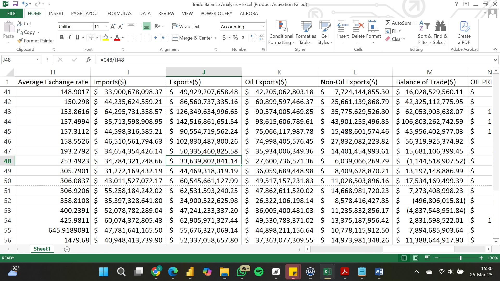
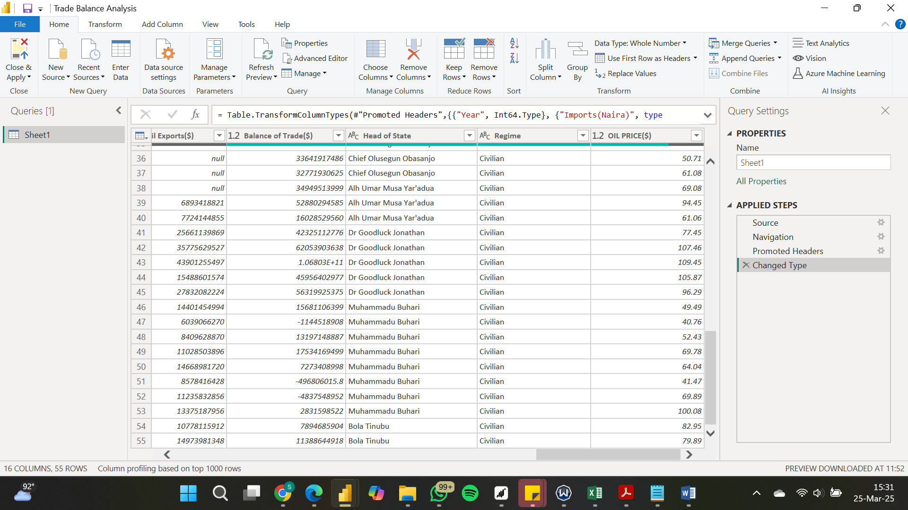
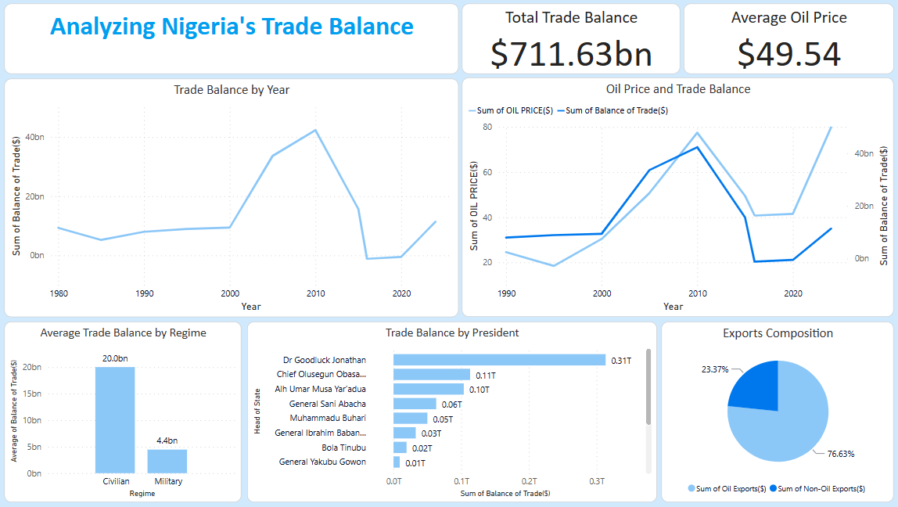

# Analyzing-Nigerias-Trade-Balance

---
## Introduction
Nigeria’s trade balance, the difference between the country’s exports and imports, is a crucial indicator of its economic health. As one of Africa’s largest economies, Nigeria relies heavily on crude oil exports, which account for a significant portion of its foreign exchange earnings. However, this dependence makes the country’s trade balance highly sensitive to external factors such as global oil price fluctuations and exchange rate movements.
This report seeks to analyze Nigeria’s trade balance trends since 1980, examining the key factors that have shaped its fluctuations and providing insights into the broader economic implications

## Problem Statement
Nigeria’s trade balance has been characterized by periods of volatility, primarily driven by its reliance on crude oil exports. While high global oil prices have historically led to trade surpluses, sharp declines have resulted in trade deficits, affecting economic stability. Additionally, fluctuations in exchange rates have further influenced trade performance, making imports more expensive and affecting the country’s overall economic outlook.
The persistent vulnerability of Nigeria’s trade balance to external shocks raises concerns about economic sustainability. Without diversification of export earnings and strategic economic policies, the country remains at risk of recurrent trade deficits.

## Tools Used
To transform, analyze and provide insights, the following tools were used:
- Microsoft Excel
- PowerBI
- Power Query

## Skills Demonstrated
- Data Collection
- Data Cleaning
- Data Manipulation
- Pivot Tables Analyzers
- Use of filters in Excel and PowerBI
- Data Visualization

## Data Exploration and Cleaning
### Data Sources and Description
The dataset used for this analysis was obtained from reputable sources, including:
- **Central Bank of Nigeria (CBN) Statistical Bulletin** – Providing trade balance figures, exchange rate data, and import/export values.
- **National Bureau of Statistics (NBS)** – Offering additional trade data and economic indicators.
- **Organization of the Petroleum Exporting Countries (OPEC)** – Supplying global crude oil price data.

The key variables examined include:
- Trade Balance (Exports minus Imports)
- Oil Prices (Annual crude oil prices in USD per barrel)
- Exchange Rates (Naira to USD exchange rates)
- Total Exports and Imports (To assess trade performance over time)
### Initial Observations
A preliminary review of the data revealed:
- Fluctuations in trade balance values, especially during periods of major oil price crashes.
- Exchange rate volatility, with significant depreciation of the naira in response to external economic shocks.
- Potential data inconsistencies, including missing values for some years and outliers in trade and exchange rate figures.
### Data Cleaning Process
To ensure accuracy and consistency, the following data cleaning steps were performed:
1.	Dropped irrelevant columns – Removed non-essential fields that were not directly relevant to the analysis.
2.	Converted columns to appropriate formats – Ensured numerical values (e.g., trade balance, oil prices) were correctly formatted for analysis.
3.	Handled missing values – Identified and addressed gaps in the dataset to prevent inaccuracies.
4.	Performed preliminary trend analysis – Examined data distributions, identified inconsistencies, and verified alignment with historical events.

Data Cleaning 1        | Data Cleaning 2
:---------------------:|:---------------------:
      |

## Data Analysis
The analysis of Nigeria’s trade balance from 1980 to 2024 reveals significant trends influenced by global oil price fluctuations, exchange rate dynamics, and economic policies. The key insights are outlined below:

**1. Correlation Between Oil Prices and Trade Balance:**

A strong direct correlation exists between global crude oil prices and Nigeria’s trade balance. A line chart was used to visualize this relationship, showing that:
- 2011–2014: Oil prices reached a significant high, coinciding with Nigeria’s highest recorded trade surplus.
- 2015–2016: A sharp decline in oil prices resulted in Nigeria recording a trade deficit in 2015.
- 2020–2021: Another drop in oil prices led to consecutive trade deficits.
These findings highlight Nigeria’s vulnerability to external shocks due to its dependence on crude oil exports.

**2. Impact of Exchange Rate and Import Costs:**

The cost of imports has steadily risen due to exchange rate depreciation and economic policies over the years. As the naira weakened, imports became more expensive, further affecting the trade balance. This suggests that exchange rate management plays a crucial role in Nigeria’s trade performance.

**3. Trade Balance Under Civilian vs. Military Regimes:**

A column chart comparing Nigeria’s trade balance under military and civilian governments reveals that:
- Trade balances were significantly larger during civilian regimes than during military rule.
- This may be linked to economic liberalization policies, trade agreements, and a relatively stable investment climate under democratic governance.

**4. Trade Balance Across Presidential Tenures:**

Using a bar chart, the trade balance was analyzed across various presidents and heads of state. The findings indicate that:
- Goodluck Jonathan’s tenure (2010–2015) recorded the most impressive trade balance, largely due to high global oil prices during this period.
- Other administrations experienced mixed results, often reflecting external economic conditions and policy decisions.

**5. Nigeria’s Export Composition:**

A pie chart illustrating Nigeria’s export breakdown highlights the dominance of crude oil exports, reinforcing the country’s dependence on oil as the primary driver of its trade balance. This lack of export diversification leaves Nigeria highly exposed to fluctuations in global oil demand and prices.

## Data Visualization

The dashboard contains 1 page of report. It was created to provide insights and answer the questions posed during the analysis phase.

## Insights and Recommendations

### Key Insights

From the analysis of Nigeria’s trade balance between 1980 and 2024, several critical insights emerged:
**1.	Heavy Reliance on Oil Exports**

- The strong correlation between oil prices and trade balance highlights Nigeria’s economic vulnerability to global oil market fluctuations.
- Periods of trade surpluses align with high oil prices, while price declines have consistently led to trade deficits.

**2.	Rising Import Costs and Exchange Rate Depreciation**

- The steady increase in import costs due to exchange rate devaluation and economic policies has negatively impacted Nigeria’s trade balance.
- The weakening of the naira has made imports more expensive, further straining trade performance.

**3.	Civilian vs. Military Regimes and Trade Performance**
- Trade balances were significantly higher under civilian administrations compared to military regimes, suggesting better economic policies and external trade engagements in democratic periods.

**4.	Presidential Tenure and Trade Balance**

- Goodluck Jonathan’s tenure (2010–2015) recorded the most impressive trade balance, mainly due to high global oil prices rather than structural economic improvements.
- Other administrations faced challenges influenced by both domestic policies and external economic conditions.

**5.	Lack of Export Diversification**

- A pie chart analysis of Nigeria’s exports confirms that crude oil dominates, reinforcing a lack of diversification in the economy.
- Over-reliance on oil exposes the country to external shocks and limits its ability to maintain a stable trade balance.

## Recommendations

To improve Nigeria’s trade balance and ensure long-term economic stability, the following recommendations should be considered:

**1.	Diversify the Economy**

- Reduce dependence on crude oil by promoting non-oil exports such as agriculture, manufacturing, and technology-driven industries.
- Invest in value-added production rather than raw material exports to increase foreign exchange earnings.

**2.	Strengthen Exchange Rate and Trade Policies**
  
- Implement exchange rate stabilization policies to reduce import costs and enhance trade competitiveness.
- Encourage local production of essential goods to reduce import dependency and improve trade balance.

**3.	Encourage Sustainable Trade Policies**
  
- Negotiate favorable trade agreements that benefit local industries and reduce unnecessary imports.
- Promote industrialization and infrastructure development to support export-driven growth.

**4.	Leverage Economic Opportunities Under Civilian Governance**
  
- Strengthen economic policies during civilian administrations to maximize trade balance performance.
- Foster transparency and good governance to attract foreign investment and improve trade relationships.

**5.	Enhance Economic Resilience Against Oil Price Shocks**
  
- Establish a sovereign wealth fund to manage oil revenue fluctuations and stabilize trade performance during oil price declines.
- Increase investments in renewable energy and alternative industries to reduce reliance on oil revenues.

